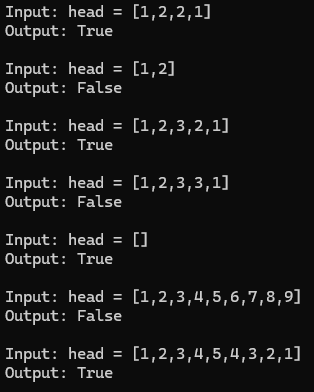

### LeetCode 234. Palindrome Linked List
Given the `head` of a singly linked list, return `true` *if it is a palindrome or* `false` *otherwise*.

---
### Example 1:

> **Input:** head = [1,2,2,1]   
> **Output:** true
---
### Example 2:

> **Input:** head = [1,2]  
> **Output:** false
---
### Code Output:

